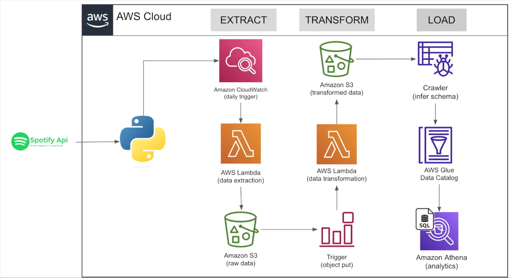

# AWS ETL Pipeline using Spotify API 🎵☁️

## 📌 Overview
This project is a **serverless ETL pipeline** built using **AWS services** to extract data from the **Spotify API**, transform it using **AWS Lambda**, and load it into **Amazon Athena** for analytics. The pipeline is scheduled to run daily using **Amazon CloudWatch**.

## 🚀 Architecture

1. **Extract** 🎯
   - AWS Lambda fetches data from the **Spotify API**.
   - Stores raw JSON data into an **S3 bucket**.
   - Triggered daily by **Amazon CloudWatch**.

2. **Transform** 🔄
   - AWS Lambda processes and cleans the raw data.
   - Transformed data is stored in another **S3 bucket**.
   - S3 **Trigger** initiates transformation automatically.

3. **Load & Analytics** 📊
   - AWS Glue **Crawler** infers schema from transformed data.
   - **AWS Glue Data Catalog** stores metadata.
   - **Amazon Athena** allows querying transformed data using **SQL**.

## 🏗️ AWS Services Used
- **AWS Lambda**: Runs serverless functions for data extraction and transformation, eliminating the need for traditional servers.
- **Amazon S3**: A scalable storage solution used to store raw and transformed data efficiently.
- **Amazon CloudWatch**: Monitors application performance and triggers scheduled Lambda executions.
- **AWS Glue Crawler**: Automatically scans data stored in S3 and determines its structure for efficient querying.
- **AWS Glue Data Catalog**: Stores metadata information, making it easier to manage and query data.
- **Amazon Athena**: A serverless query service that allows direct SQL querying of data stored in S3, without requiring a database setup.
- **Amazon S3 Event Triggers**: Automates data transformation by invoking AWS Lambda functions whenever new data is uploaded.

## 🔗 Resources
- **Spotify API Docs**: [https://developer.spotify.com/documentation/web-api](https://developer.spotify.com/documentation/web-api)
- **AWS Glue**: [https://aws.amazon.com/glue](https://aws.amazon.com/glue)
- **Amazon Athena**: [https://aws.amazon.com/athena](https://aws.amazon.com/athena)
